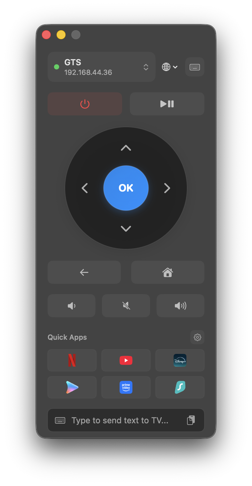

# GTV Remote

<p align="center">
  
</p>

<p align="center">
  <strong>A modern, native macOS remote control & quick launcher for Google TV / Android TV.</strong><br>
  <em>Low-latency TLS 2-way control, mDNS auto-discovery, instant text typing, quick app launchers, and keyboard hotkeys right from your Mac.</em>
</p>

<p align="center">
  
  
  
  
  
</p>

---

> [!NOTE]
> **🤖 100% Built with Google Antigravity**
>
> This entire application—including TLS socket communication, Protobuf packet serialization, mDNS auto-discovery, SwiftUI views, keyboard event monitoring, drag-and-drop quick app reordering, 7-language multi-localization, and build automation—was **100% designed, implemented, and verified pair-programming autonomously with Google Antigravity**.

---

## Screenshot

<p align="center">
  
  <br>
  <em>GTV Remote: Native macOS Frosted Glass UI</em>
</p>

---

## Features

- **Native macOS Experience**:
  - Built with 100% Swift, SwiftUI, and AppKit with native `.sidebar` frosted glass material (`NSVisualEffectView`).
  - Sleek, custom 45-degree tilted remote icon in the macOS status bar for one-click access or focus toggle.
  - Window stays background-resident when closed; reopening via Dock or Menu Bar is instant without process restarting.

- **Zero-Config Network Discovery & Instant Reconnect**:
  - Automatic zero-configuration Bonjour / mDNS discovery of all Google TV and Android TV devices on your local network (`_androidtvremote2._tcp`).
  - Unicode and international device name resolution.
  - Automatically remembers the last connected TV and re-establishes connection instantly upon launch.

- **Fast, Secure TLS Connection**:
  - Secure two-way mutual TLS encryption with Android TV Remote v2 protocol.
  - Built-in transient RSA-2048 client certificate generation powered directly by Apple's `Security.framework` (no external `openssl` binary required).

- **Full Keyboard Navigation & Visual Feedback**:
  - Navigate TV menus effortlessly with Arrow keys, `Enter`, `Esc`, `Home`, `Space`, and volume controls.
  - Real-time **0.15s button press feedback animations** that highlight on-screen buttons when triggered from your keyboard.

- **Smart Remote Text Input & Clipboard Sync**:
  - Integrated smart input bar allows you to type searches, URLs, and passwords directly into your TV.
  - 1-click clipboard paste (`Cmd + V`) sends text from your Mac clipboard straight to your TV's input field.

- **Customizable Quick Apps Launcher**:
  - Built-in presets for popular streaming platforms: **YouTube, Netflix, Disney+, Apple TV, Prime Video, Coupang Play, Max, Paramount+, YouTube TV, Tubi, Pluto TV, Google Play Store, Surfshark, Plex, Spotify, Twitch, Stremio**.
  - Unified app manager with **drag-and-drop reordering** and visibility checkboxes.
  - Support for adding, editing, and removing custom deep links (`https://` or `app://`).
  - Fixed 3-column grid maintaining consistent button dimensions.
  - Direct keyboard triggers (`1` through `9`) to launch your top quick apps instantly.

- **Multi-Language Localization (7 Languages)**:
  - Supports **English**, **한국어 (Korean)**, **简体中文 (Simplified Chinese)**, **日本語 (Japanese)**, **Deutsch (German)**, **Français (French)**, and **Español (Spanish)**.
  - Automatically respects your macOS system language preference on first launch.
  - Dedicated globe button on the header allows switching UI languages on the fly at any time.

---

## Keyboard Shortcuts Reference

When the remote window is active, the following physical hotkeys are available:

| Key | Remote Function | Description |
| :--- | :--- | :--- |
| **Arrow keys (↑ ↓ ← →)** | `DPAD_UP / DOWN / LEFT / RIGHT` | Directional navigation |
| **Return / Enter** | `DPAD_CENTER` | Select / OK |
| **Esc / Backspace** | `BACK` | Back / Exit menu |
| **H** | `HOME` | Go to TV Home screen |
| **Space** | `MEDIA_PLAY_PAUSE` | Toggle play or pause |
| **+ / =** | `VOLUME_UP` | Volume Up |
| **- / _** | `VOLUME_DOWN` | Volume Down |
| **M** | `VOLUME_MUTE` | Toggle Mute |
| **P** | `POWER` | Toggle Power On / Off |
| **A** | `ASSISTANT` | Trigger Google Assistant |
| **I** | `INPUT` | Change Video Input source |
| **1 ~ 9** | Quick App 1–9 | Launch Quick Apps 1 through 9 directly |
| **Cmd + V** | Clipboard Sync | Send current Mac clipboard text to TV |
| **Cmd + W** | Hide Window | Conceal remote window (stays active in background) |

---

## Installation & Build

### Prerequisites
- macOS 14.0 (Sonoma) or later
- Xcode 16+ or Swift 6.0+ Command Line Tools

### Build and Install via Makefile

Clone the repository and run:

```bash
# Build Release binary, package into /Applications/GTV Remote.app, and launch
make install

# Package release into .app, .dmg, and .zip inside dist/
make package
```

To clean build artifacts:
```bash
make clean
```

To uninstall:
```bash
make uninstall
```

---

## Project Structure

```
gtv-remote/
├── .github/workflows/release.yml     # Automated CI/CD release workflow
├── AGENTS.md                         # Guidelines for AI agents and developers
├── Makefile                          # Release packaging and deployment script
├── Package.swift                     # Swift Package Manager manifest
├── LICENSE                           # MIT License
├── README.md                         # Project documentation
├── Resources/
│   ├── AppIcon.icns                  # macOS application bundle icon
│   └── Info.plist                    # Bundle configuration and permissions
├── Sources/
│   └── GTVRemote/
│       ├── App/                      # Application entry & keyboard event monitor
│       │   ├── GTVRemote.swift
│       │   └── KeyboardMonitor.swift
│       ├── Core/
│       │   ├── Network/              # mDNS discovery & NIO TLS socket bridge
│       │   │   ├── BonjourResolver.swift
│       │   │   ├── DeviceDiscoveryService.swift
│       │   │   ├── TLSSocketBridge.swift
│       │   │   └── TVConnectionManager.swift
│       │   ├── Proto/                # Protobuf protocol bindings
│       │   │   ├── pairing.pb.swift
│       │   │   └── remote.pb.swift
│       │   └── Security/             # RSA-2048 certificate generation
│       │       └── CertificateManager.swift
│       ├── Localization/             # 7-language localization engine
│       │   ├── Languages/            # Language-specific string implementations
│       │   ├── L10n.swift
│       │   ├── LocalizableStrings.swift # Protocol defining localized string keys
│       │   └── LocalizationManager.swift
│       ├── Models/                   # Data structures & App Shortcut catalog
│       │   ├── AppShortcut.swift
│       │   ├── Models.swift
│       │   └── RemoteKey.swift
│       ├── ViewModels/               # Observable remote business logic
│       │   └── RemoteViewModel.swift
│       └── Views/                    # SwiftUI interface & Sheets
│           ├── Components/
│           │   ├── DPadView.swift
│           │   ├── RemoteButtonStyles.swift
│           │   └── SmartInputBar.swift
│           ├── Sheets/
│           │   ├── AppShortcutsSettingsView.swift
│           │   ├── PairingSheetView.swift
│           │   └── ShortcutsView.swift
│           └── RemoteControlView.swift
└── assets/                           # Screenshots and documentation media
    ├── app_icon.png
    └── remote_main.png
```

---

## Open Source License

This project is licensed under the **MIT License**. See the [LICENSE](LICENSE) file for details.
